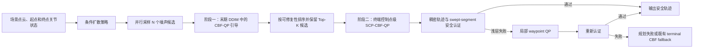

# 双阶段安全修正方法总结与论文写作指南

> 用途：本文件用于指导其他 Agent 基于当前代码实现撰写论文的 Method、Introduction、Experiments 和 Discussion。  
> 当前双阶段模式的代码名称为 `qp_guided_diffusion_post_qp`。  
> 本文件只总结仓库中已经实现的机制；凡是尚无实验结果支撑的结论均标记为“待验证”，不得直接写成论文事实。

---

## 1. 方法定位

### 1.1 一句话定义

本方法面向复杂工件附近的机械臂关节空间轨迹生成，在扩散模型产生 B 样条控制点残差的过程中，引入**去噪末期的表面采样 CBF-QP 引导**，随后对生成候选执行**终端控制点级 CBF-QP 修正与稠密安全认证**，从而将安全约束同时嵌入生成过程和最终输出校正过程。

建议论文中将其称为：

- 中文：**双阶段表面感知 CBF-QP 安全修正**
- 英文：**Two-stage Surface-aware CBF-QP Safety Correction**
- 更强调生成过程时：**Two-stage CBF-QP-guided Diffusion Planning**

### 1.2 核心研究问题

仅依赖离线数据训练的扩散策略能够学习轨迹分布，但网络输出本身不提供硬碰撞约束保证。在复杂工件附近，以下问题尤其突出：

1. 模型可能生成局部侵入工件或安全间隙不足的轨迹；
2. 只在输出端做一次后处理，可能需要较大的轨迹形变，并破坏生成轨迹的平滑性或可行性；
3. 只在去噪过程中加入软代价，也不能保证最终离散轨迹及相邻轨迹点之间无碰撞；
4. 全时域、全表面、全候选反复求解大规模优化问题的开销较高。

因此，当前实现采用“**生成内预防 + 生成后认证修复**”的层级结构：

1. 第一阶段在扩散去噪尾部，将候选引向更易修复、更安全的区域；
2. 第二阶段对优选候选进行局部控制点修正和高密度安全认证；
3. 对认证后仍存在浅层局部风险的轨迹，可触发 waypoint 级局部 QP 作为内部补救。

### 1.3 论文中可使用的中心论点

> In robot motion planning around complex workpieces, we integrate surface-aware CBF-QP constraints into both the late denoising process and the terminal trajectory refinement, allowing the diffusion model to generate repairable candidates while retaining a final dense safety certification stage.

注意：在没有完整对比实验前，应使用 `integrate`、`enable`、`is designed to` 等有限表述，不应直接声称“显著提升安全率”“保证绝对安全”或“首次实现”。

---

## 2. 整体流程



双阶段模式执行顺序如下：

1. 条件扩散策略并行生成 \(N\) 个 B 样条自由控制点残差候选；
2. 在最后若干 DDIM 去噪步，对当前 clean sample 估计 \(\hat{x}_0\) 做表面 SDF 风险评估；
3. 选取最有修复价值的候选，利用局部线性化 CBF 约束求解小规模 QP；
4. 将 QP 修正结果按渐增权重融合回 \(\hat{x}_0\)，再执行 DDIM 更新；
5. 去噪结束后，根据最后一次引导得到的可修复性得分选择候选子集；
6. 对这些候选执行终端控制点级 SCP-CBF-QP；
7. 使用更密集的 B 样条采样和相邻状态插值执行安全认证；
8. 若认证只出现局部浅层失败，则在碰撞窗口内执行 waypoint 级 QP 并重新认证；
9. 输出首个通过认证的候选；若没有候选通过，则记录失败，或在启用时调用已有 terminal CBF fallback。

---

## 3. 轨迹与安全建模

### 3.1 B 样条轨迹表示

机械臂关节轨迹由五次 B 样条表示：

\[
\mathbf q(t)=\mathbf B(t)\mathbf C,
\]

其中：

- \(\mathbf q(t)\in\mathbb R^{6}\) 为 UR5e 在时刻 \(t\) 的关节状态；
- \(\mathbf B(t)\) 为 B 样条基函数行向量；
- \(\mathbf C\in\mathbb R^{M\times6}\) 为关节空间控制点矩阵；
- 当前 C-space 配置采用 \(M=16\) 个控制点、五次 B 样条；
- 起点侧和终点侧各固定 3 个控制点，因此扩散策略预测中间 10 个自由控制点的标准化残差。

自由控制点不是从零直接生成，而是在起终点线性插值基线之上预测残差。设线性基线为 \(\mathbf C_{\mathrm{lin}}\)，数据统计均值和标准差为 \(\boldsymbol\mu,\boldsymbol\sigma\)，网络预测的标准化残差为 \(\mathbf r\)，则自由控制点可概括为

\[
\mathbf C_{\mathrm{free}}
=
\mathbf C_{\mathrm{lin,free}}
+\boldsymbol\mu
+\boldsymbol\sigma\odot\mathbf r.
\]

该表示使扩散生成、CBF-QP 修正和最终轨迹重建共享同一组控制点变量。

### 3.2 机器人表面与环境距离

当前几何后端使用 PyBullet 计算机器人运动学，并通过工件 SDF 查询机器人表面点到工件的有符号距离。

对机器人链节 \(l\) 上的表面采样点 \(\mathbf p_l\)，其世界坐标为

\[
\mathbf x_l(\mathbf q)=FK_l(\mathbf q,\mathbf p_l).
\]

工件 SDF 记为 \(\phi(\mathbf x)\)：

- \(\phi(\mathbf x)>0\)：点在工件外部；
- \(\phi(\mathbf x)=0\)：点位于表面；
- \(\phi(\mathbf x)<0\)：点进入工件内部。

当前引导默认重点使用：

- `pen_link`：80 个表面点；
- `wrist_3_link`：16 个表面点。

这一设计聚焦于焊笔和末端腕部等最接近工件、碰撞风险最高的部位。论文若声称覆盖“整机碰撞”，必须确认实验验证器是否还检查了其他链节；不能只根据引导阶段的两个链节采样作此表述。

### 3.3 CBF 安全函数

对表面点定义安全函数

\[
h_l(\mathbf q)=\phi\!\left(\mathbf x_l(\mathbf q)\right)-d_{\mathrm{safe}},
\]

其中 \(d_{\mathrm{safe}}\) 为期望安全距离。理想安全条件为

\[
h_l(\mathbf q)\ge 0.
\]

在当前轨迹附近进行一阶线性化：

\[
h_l(\mathbf q+\Delta\mathbf q)
\approx
h_l(\mathbf q)
+
\nabla_{\mathbf x}\phi^\top
\mathbf J_l(\mathbf q)\Delta\mathbf q,
\]

其中 \(\mathbf J_l(\mathbf q)\) 是表面点位置对关节变量的雅可比矩阵。记

\[
\mathbf g_l^\top
=
\nabla_{\mathbf x}\phi^\top\mathbf J_l(\mathbf q),
\]

则局部安全约束可写为

\[
\mathbf g_l^\top\Delta\mathbf q+s_l
\ge
d_{\mathrm{target}}-h_l(\mathbf q),
\qquad s_l\ge0.
\]

松弛变量 \(s_l\) 用于避免局部线性化或多约束冲突导致 QP 完全不可行，但其平方项使用较大权重惩罚。

### 3.4 从关节修正映射到控制点修正

由于

\[
\Delta\mathbf q(t)=\mathbf B(t)\Delta\mathbf C,
\]

每个时刻的 CBF 约束可以直接转换为自由控制点修正量 \(\Delta\mathbf C\) 的线性约束。这样可以：

1. 保持轨迹始终位于 B 样条参数化空间；
2. 只优化实际影响风险时刻的自由控制点；
3. 固定起点和终点附近的控制点；
4. 通过控制点二阶差分正则保持整体平滑性。

---

## 4. 阶段一：去噪末期的 CBF-QP 引导

### 4.1 动机

若等到扩散过程完全结束后才修正，候选可能已经落入深碰撞区域，局部 QP 难以用小幅修正恢复。阶段一的目的不是对每一步都做昂贵优化，而是在低噪声的去噪尾部对 \(\hat{x}_0\) 进行少量、渐进的安全引导。

### 4.2 并行候选与触发时机

当前默认设置为：

- 候选数 \(N=32\)；
- DDIM 推理步数为 10；
- 最后 3 个去噪步执行安全引导；
- `eta=0`，即确定性 DDIM 更新；
- 每个引导步最多对 4 个候选执行 QP；
- 每个 QP 内部最多执行 2 轮 SCP。

若未显式设置 `guidance_timesteps`，程序按“剩余去噪步数”触发最后 3 步。论文中建议称为 **late-denoising guidance**，而不是模糊地称为“训练时安全约束”，因为该机制发生在推理阶段。

### 4.3 当前 clean sample 估计

对于扩散状态 \(\mathbf x_t\) 和模型输出，首先按照调度器的 prediction type 重构 clean sample 估计 \(\hat{\mathbf x}_0\)。随后将每个候选的 \(\hat{\mathbf x}_0\) 解释为标准化自由控制点残差，恢复完整控制点和关节轨迹。

### 4.4 粗粒度风险筛选

阶段一使用 32 个 B 样条采样状态进行粗检查。对候选 \(i\)，代码计算：

- 最小 SDF；
- 穿透表面点数量；
- 最大穿透深度；
- 累积碰撞风险；
- 基于修复代价、松弛估计和碰撞风险的可修复性得分。

当前排序得分形式可概括为

\[
R_i
=
w_1 C_i^{\mathrm{repair}}
+w_2 S_i
+w_3 C_i^{\mathrm{collision}},
\]

默认权重为

\[
(w_1,w_2,w_3)=(1,10,1).
\]

实现中的第一次批量筛选使用碰撞风险近似修复代价，并用“最大穿透深度 × 穿透点数量”近似松弛负担。之后只对排名靠前的候选执行 QP probe 和实际修复，以控制计算量。

### 4.5 局部 SCP-CBF-QP

对于未达到安全触发距离、但又不属于深穿透的候选：

1. 将连续低间隙时刻聚合为风险段；
2. 按风险分数排序；
3. 在每个风险段峰值附近构造局部时间窗口；
4. 保留最危险的表面点约束；
5. 对影响这些约束的自由控制点求解 QP。

QP 目标可写为

\[
\min_{\Delta\mathbf C,\mathbf s}
\quad
\|\Delta\mathbf C\|_2^2
+\lambda_s\|\mathbf D_2(\mathbf C+\Delta\mathbf C)\|_2^2
+\rho\|\mathbf s\|_2^2,
\]

约束包括：

\[
\mathbf A_{\mathrm{cbf}}\Delta\mathbf C+\mathbf s
\ge
\mathbf b_{\mathrm{cbf}},
\]

\[
-\delta_k
\le
\Delta\mathbf C
\le
\delta_k,
\]

\[
-1
\le
\mathbf B_{\mathrm{limit}}(\mathbf C+\Delta\mathbf C)
\le
1.
\]

其中：

- \(\lambda_s=0.25\) 为平滑正则权重；
- \(\rho=10^5\) 为松弛惩罚；
- 信赖域从 0.015 逐渐增大到 0.05；
- 深穿透阈值为 0.03 m，超过该深度的候选被视为局部 QP 难以修复；
- 阶段一使用 0.06 m 触发距离和 0.05 m 目标安全距离。

### 4.6 渐进融合与 DDIM 回注

阶段一不直接用修复结果完全替换网络预测，而是执行

\[
\tilde{\mathbf x}_0
=
(1-\beta_k)\hat{\mathbf x}_0
+\beta_k\mathbf x_0^{\mathrm{QP}},
\]

当前三个引导步的默认融合权重为

\[
\beta_k\in\{0.25,0.50,0.75\}.
\]

随后利用覆写后的 \(\tilde{\mathbf x}_0\) 执行 DDIM 更新，得到下一时刻状态 \(\mathbf x_{t-1}\)。因此，安全修正会继续影响后续去噪，而不是仅修改最终输出。

这一机制的论文意义是：**将后验轨迹投影转化为去噪尾部的渐进约束引导**。但“更好地保持数据分布”或“减少最终修正量”仍需通过实验或消融验证后才能作为结果性结论。

---

## 5. 阶段二：终端控制点级安全修正与认证

### 5.1 候选交接

在双阶段模式中，第一阶段结束时暂不执行其独立终端认证，而是：

1. 读取最后一次引导记录中的可修复性排序；
2. 取 `final_post_qp_candidates + final_backup_candidates` 个候选；
3. 当前配置分别为 4 和 4，因此最多向第二阶段传递 8 个候选；
4. 若排序信息不可用，则回退到最终候选的原始顺序。

这使第二阶段集中计算于更可能修复成功的候选，而不是重新处理全部 32 个样本。

### 5.2 更密集的控制点级 SCP-QP

第二阶段对候选重新执行风险筛选和控制点级 SCP-QP。当前配置为：

- 粗检查状态数：64；
- 最多选择 6 个风险段；
- 风险窗口半径：5 个采样步；
- 每段选择 5 个高风险时刻；
- 每段至少保留 6 个候选约束；
- 全局最多保留 24 个活动约束；
- 最多执行 2 轮 SCP；
- 第一轮和第二轮局部控制点修正上限均为 0.025；
- 相对原始候选的累计修正上限为 0.05；
- 第二轮风险触发阈值在第一轮基础上增加 0.005 m。

第二轮 SCP 会在第一轮更新后的轨迹上重新计算 SDF、风险段、表面梯度和雅可比，因此能够处理第一轮修正后残余或新出现的局部风险。

### 5.3 第二阶段安全阈值

当前配置文件中，第二阶段控制点修正使用：

- \(d_{\mathrm{safe}}=0.005\) m；
- \(d_{\mathrm{trigger}}=0.005\) m；
- \(d_{\mathrm{cert}}=0.001\) m；
- margin buffer \(=0.005\) m。

因此控制点 QP 的线性化目标 margin 为

\[
d_{\mathrm{cert}}+d_{\mathrm{buffer}}
=0.006\ \mathrm m
\]

（这里的 margin 是相对于 \(d_{\mathrm{safe}}\) 定义的 \(h\)）。最终证书要求

\[
\min h \ge d_{\mathrm{cert}},
\]

等价于所有被检查表面点满足

\[
\min\phi(\mathbf x)\ge d_{\mathrm{safe}}+d_{\mathrm{cert}}
=0.006\ \mathrm m.
\]

需要特别注意：阶段一使用的 0.05 m 是较保守的去噪引导目标，而第二阶段当前证书对应约 0.006 m 的最小 SDF 要求。论文中必须区分这两组阈值，不能写成全流程统一使用 5 cm 的硬安全证书。

### 5.4 稠密安全证书

每个终端候选在 256 个 B 样条采样状态上进行检查，并在相邻状态之间插入 3 个中间状态，以覆盖离散采样点之间的 swept segment。认证规则为

\[
\min_{t,l}\left[
\phi(\mathbf x_l(\mathbf q_t))-d_{\mathrm{safe}}
\right]
\ge d_{\mathrm{cert}}.
\]

只有重新认证成功的候选才应被解释为当前安全准则下的成功规划结果。

### 5.5 候选选择

终端修正模块首先按以下顺序进行粗筛选：

1. 更大的最小安全 margin；
2. 更少的危险时刻；
3. 更低的总风险；
4. 更短的路径；
5. 更高的平滑性；
6. 候选索引。

实际修复最多尝试排序前 5 个候选，并在首个通过证书的候选处停止。该过程强调“安全认证优先”；路径长度和平滑性主要用于安全水平相近时的次级排序。

---

## 6. 认证后的 waypoint 级局部 QP

### 6.1 它不是独立的第三主阶段

论文建议将 waypoint QP 描述为第二阶段内部的**浅层失败恢复机制**，而不是与前两阶段并列的第三阶段。其触发条件是：

\[
-0.01\ \mathrm m
\le
d_{\min}
<
d_{\mathrm{safe}}+d_{\mathrm{cert}}.
\]

这意味着：

- 已通过认证：不触发；
- 轻微穿透或间隙不足：尝试局部 waypoint QP；
- 穿透深于 \(-0.01\) m：不使用这一局部补救。

### 6.2 优化变量与约束

控制点级 QP 修正的是 B 样条控制点，而 waypoint QP 直接修正认证轨迹碰撞窗口内部的关节状态：

\[
\min_{\Delta\mathbf Q,\mathbf s}
\quad
\|\Delta\mathbf Q\|_2^2
+\lambda_w\|\mathbf D_2\Delta\mathbf Q\|_2^2
+\rho\|\mathbf s\|_2^2.
\]

其约束包含：

1. 线性化表面距离约束；
2. 关节位置上下限；
3. 相邻 waypoint 最大变化约束；
4. 二阶差分最大变化约束；
5. 每个 waypoint 的局部修正信赖域。

当前默认参数：

- 最多处理 2 个碰撞段；
- 窗口半径为 2；
- waypoint 修正上限为 0.02 rad；
- 最大相邻关节变化为 0.2 rad/step；
- 最大二阶差分为 0.4 rad/step²；
- 目标距离为 \(d_{\mathrm{safe}}+0.005\) m；
- SLSQP 最大迭代数为 100。

修正后必须再次执行相同的稠密安全认证，不能仅以 QP 求解成功作为规划成功。

---

## 7. 算法伪代码

```text
Input:
    scene observation o
    start/goal joint states q_s, q_g
    diffusion policy ε_θ
    workpiece SDF φ
Output:
    certified joint trajectory τ or failure

1: Sample N initial Gaussian noises {x_T^i}_{i=1}^N
2: for each DDIM step t do
3:     Predict model output and reconstruct clean estimates {x̂_0^i}
4:     if t belongs to the final G guidance steps then
5:         Reconstruct B-spline control points and coarse trajectories
6:         Evaluate surface-point SDF risk for all candidates
7:         Rank candidates by repairability
8:         for each selected candidate do
9:             Build risk segments and local active CBF constraints
10:            Solve trust-region SCP-QP on influential free control points
11:            Blend repaired residual with x̂_0^i
12:        end for
13:        Perform DDIM update using the guided clean estimates
14:    else
15:        Perform a standard DDIM update
16:    end if
17: end for
18: Rank final candidates and retain Top-K candidates
19: for each retained candidate in rank order do
20:     Recompute risk segments at a denser temporal resolution
21:     Run terminal control-point SCP-CBF-QP
22:     Perform dense B-spline and swept-segment certification
23:     if certified then return candidate
24:     if failure is shallow and localized then
25:         Run local waypoint QP and recertify
26:         if certified then return repaired trajectory
27:     end if
28: end for
29: Invoke configured terminal fallback or return planning failure
```

---

## 8. 计算复杂度与效率逻辑

设候选数为 \(N\)，每个候选的粗检查时刻数为 \(T_c\)，表面采样点数为 \(P\)，每个 QP 选中的自由控制点数为 \(M_a\)，活动 CBF 约束数为 \(K\)。

1. 阶段一每个引导步的批量几何筛选量级约为 \(O(NT_cP)\)。当前实现可使用 Torch/CUDA 批量完成候选正运动学、表面点变换和 SDF 查询。
2. 只有 \(N_{\mathrm{QP}}\ll N\) 个候选进入 QP；当前默认 \(N_{\mathrm{QP}}=4\)，因此优化开销不会随全部候选等比例增长。
3. QP 的有效变量只包含影响活动约束的自由控制点，主变量规模约为 \(6M_a+K\)，而非对全时域 waypoint 全部优化。
4. 阶段二只处理从阶段一传递的 Top-K 候选，当前最多为 8 个，实际修复最多尝试排序前 5 个，并在首个认证成功时提前终止。
5. 最终认证的量级约为 \(O(T_{\mathrm{cert}}P)\)，插入 swept-segment 中间点后有效检查状态数进一步增大。该步骤是最终可靠性的重要来源，也可能成为端到端时延的重要组成。

论文中不要仅依据以上结构声称复杂度或速度“显著降低”。应使用日志中的 `diffusion_time`、`guided_qp_time`、`certificate_time`、`waypoint_fallback_time` 和 `total_planning_time` 给出实测结果。

---

## 9. 当前默认参数总表

以下数值来自当前共享配置文件和配置回退项。命令行参数可以覆盖它们，论文最终版本应以实际实验日志中的参数为准。

| 类别 | 参数 | 当前值 | 含义 |
|---|---:|---:|---|
| 模式 | `planner_mode` | `baseline` | 必须显式设为 `qp_guided_diffusion_post_qp` 才启用双阶段 |
| 扩散 | `num_candidates` | 32 | 并行候选数 |
| 扩散 | `candidate_inference_steps` | 10 | 推理去噪步数 |
| 阶段一 | `guidance_steps` | 3 | 末期引导步数 |
| 阶段一 | `qp_candidates` | 4 | 每个引导步进行 QP 的候选数 |
| 阶段一 | `qp_inner_scp_rounds` | 2 | 每次引导的 SCP 轮数 |
| 阶段一 | `coarse_check_steps` | 32 | 候选粗评估采样数 |
| 阶段一 | `guidance_trigger_distance` | 0.06 m | QP 风险触发距离 |
| 阶段一 | `guidance_safe_distance` | 0.05 m | 引导目标安全距离 |
| 阶段一 | `trust_region_start/end` | 0.015 / 0.05 | 渐增信赖域 |
| 阶段一 | `blend_weights` | 0.25/0.50/0.75 | 渐进融合权重 |
| 候选交接 | `final_post_qp_candidates` | 4 | 主 post-QP 候选 |
| 候选交接 | `final_backup_candidates` | 4 | 备份候选 |
| 阶段二 | `check_steps` | 64 | 终端粗检查采样数 |
| 阶段二 | `cert_steps` | 256 | 最终证书轨迹采样数 |
| 阶段二 | `cert_swept_intermediate` | 3 | 相邻证书点间插值数 |
| 阶段二 | `max_risk_segments` | 6 | 最大风险段数 |
| 阶段二 | `window_radius` | 5 | 风险窗口半径 |
| 阶段二 | `points_per_segment` | 5 | 每段风险时刻数 |
| 阶段二 | `active_constraints` | 24 | 最大活动表面约束数 |
| 阶段二 | `d_safe` | 0.005 m | 证书安全距离基值 |
| 阶段二 | `d_trigger` | 0.005 m | 终端风险触发值 |
| 阶段二 | `d_cert` | 0.001 m | 证书附加 margin |
| 阶段二 | `eps_deep` | 0.03 m | 深穿透阈值 |
| 阶段二 | `lambda_s` | 0.25 | 平滑项权重 |
| 阶段二 | `rho` | \(10^5\) | 松弛变量权重 |
| 几何 | `pen_link` points | 80 | 焊笔表面采样点 |
| 几何 | `wrist_3_link` points | 16 | 腕部表面采样点 |
| waypoint QP | `min_clearance_trigger` | -0.01 m | 最深可尝试恢复的间隙 |
| waypoint QP | `delta_max` | 0.02 rad | 单 waypoint 最大关节修正 |

---

## 10. 建议的论文 Method 结构

### 3.1 Problem Formulation and Trajectory Representation

应写：

- 工件点云、起终点关节状态和目标轨迹；
- 五次 B 样条控制点表示；
- 固定端点控制点和自由控制点残差；
- 机器人表面点、工件 SDF 与安全函数定义。

核心信息：生成变量与安全修正变量统一为 B 样条自由控制点。

### 3.2 Conditional Diffusion Trajectory Generation

应写：

- 条件观测如何进入扩散策略；
- 多候选并行采样；
- DDIM clean sample 估计；
- 说明安全机制只在推理期加入，不改变现有训练目标（除非后续训练代码另有修改）。

### 3.3 Late-stage Surface-aware CBF-QP Guidance

按“动机—设计—优势”组织：

1. 动机：终端单次投影难以恢复深碰撞候选；
2. 设计：末期 \(\hat{x}_0\) 风险筛选、Top-K QP、SCP、渐进融合、DDIM 回注；
3. 待验证优势：减少深碰撞候选、提高候选可修复性、降低终端修正负担。

### 3.4 Terminal CBF-QP Refinement and Safety Certification

应写：

- 阶段间候选排序与 Top-K 交接；
- 局部风险段构造；
- 控制点 QP 目标和全部约束；
- 两轮 SCP；
- 稠密状态及 swept-segment 认证；
- waypoint 级浅层失败恢复。

### 3.5 Implementation Details

应写：

- 候选数、去噪步数、引导步数；
- 表面采样点数量；
- 两阶段各自的检查分辨率与阈值；
- QP/SCP 次数、信赖域、松弛惩罚；
- PyBullet、SDF 查询和 GPU 批量粗评估。

---

## 11. 实验与消融设计建议

### 11.1 必须包含的基线

| 方法 | 对应模式 | 验证目的 |
|---|---|---|
| 原始扩散规划 | `baseline` | 无安全修正基线 |
| 仅终端修正 | `post_qp` | 验证传统后处理贡献 |
| 仅去噪末期引导 | `qp_guided_diffusion` | 验证生成内引导贡献 |
| 双阶段方法 | `qp_guided_diffusion_post_qp` | 验证组合效果 |

### 11.2 建议报告的主要指标

安全性：

- collision-free planning success rate；
- 最小 SDF / 最小 clearance；
- 穿透轨迹比例；
- 最大穿透深度；
- 危险时刻或穿透点数量；
- 稠密证书通过率；
- waypoint QP 恢复率。

轨迹质量：

- 关节空间路径长度；
- 二阶差分平滑度；
- 起终点误差；
- 相对原始生成轨迹的控制点修正范数；
- 速度和加速度约束违反率。

效率：

- 总规划时间；
- 扩散网络时间；
- 阶段一 QP 时间；
- 阶段二 QP 时间；
- 安全认证时间；
- QP 调用次数与成功次数。

### 11.3 关键消融

1. 去除阶段一，只保留 post-QP；
2. 去除阶段二，只保留 late-stage guidance；
3. 引导步数：1 / 2 / 3 / 5；
4. 候选数：1 / 4 / 8 / 16 / 32；
5. 每步 QP 候选数；
6. 固定融合权重与渐增融合权重；
7. 固定信赖域与渐增信赖域；
8. 去除第二轮 SCP；
9. 去除 swept-segment 插值认证；
10. 去除 waypoint QP；
11. 只采样 `pen_link` 与同时采样 `pen_link + wrist_3_link`；
12. 安全距离和活动约束数量敏感性。

### 11.4 需要证据才能写入正文的假设

以下内容目前属于方法动机或待验证假设：

- 第一阶段减少第二阶段所需修正量；
- 渐进融合比硬替换更好地保持扩散先验；
- 双阶段方法比单阶段方法具有更高的安全成功率；
- 风险段局部化显著降低计算开销；
- 表面采样比单一末端点距离更全面；
- swept-segment 认证减少离散采样漏检。

只有在相应对比、消融或统计结果完成后，才能将这些内容改写为 `we show` 或 `the results demonstrate`。

---

## 12. 写作边界与实现注意事项

### 12.1 不要写成严格的连续时间 CBF 安全保证

当前实现使用：

- 离散 B 样条采样；
- 表面点采样；
- SDF 数值梯度；
- 局部一阶线性化；
- 有限次 SCP；
- 插值近似 swept-segment 检查。

因此更准确的表述是：

> The method enforces locally linearized surface-distance constraints and accepts a trajectory only after dense sampled certification under the adopted SDF model.

除非补充严格理论证明，不能宣称对连续时间、完整机器人几何和所有模型误差提供形式化的绝对安全保证。

### 12.2 区分三种“安全”

1. **引导安全目标**：阶段一 5 cm 目标，用于把生成过程推向安全区域；
2. **终端 CBF-QP margin**：阶段二局部线性化约束目标；
3. **最终证书规则**：当前约等价于最小 SDF 不低于 6 mm。

论文应明确区分这三者。

### 12.3 区分两个主阶段和内部 SCP 轮次

- 主阶段一：去噪末期 QP 引导；
- 主阶段二：终端 post-QP + certification；
- 每个阶段内部都可能执行两轮 SCP；
- waypoint QP 是第二阶段认证失败后的局部补救。

不能把“两轮 SCP”误称为“双阶段方法”。

### 12.4 当前组合封装的成功状态需谨慎使用

终端 `SurfaceCBFQPGuidanceRunner` 会在证书失败时仍返回一个最佳候选，并通过日志中的以下字段区分真实结果：

- `certificate_success`；
- `final_success_source`；
- `fallback_used`；
- `selected_candidate_certificate_min_clearance`。

当前双阶段推理/验证组合封装中存在将 `planning_success` 直接置为 `True` 的路径。因此，论文统计不应只依赖外层 `planning_success`，应以最终证书字段和独立 PyBullet 碰撞评分为准。

### 12.5 配置覆盖

共享 YAML 的默认 `planner_mode` 仍为 `baseline`。只有显式设置

```text
--planner-mode qp_guided_diffusion_post_qp
```

才会运行双阶段方法。所有 CLI 参数均可能覆盖 YAML，因此复现实验时必须保存实际展开后的参数和日志，而不是只引用配置文件。

---

## 13. 可直接交给论文写作 Agent 的任务提示

```text
请基于 TWO_STAGE_SAFETY_CORRECTION_METHOD.md 撰写论文方法部分。

要求：
1. 将方法命名为 Two-stage Surface-aware CBF-QP Safety Correction。
2. 先定义 B-spline 控制点残差、机器人表面 SDF 和安全函数，再介绍两个阶段。
3. 阶段一必须写清：最后 3 个 DDIM 步、x0 clean estimate、候选风险排序、
   Top-K SCP-CBF-QP、渐进融合、重新进入 DDIM 更新。
4. 阶段二必须写清：候选交接、控制点级 SCP-QP、风险段与活动约束、
   稠密 B-spline + swept-segment 认证，以及浅层失败时的 waypoint QP。
5. 严格区分阶段一 0.05 m 引导目标和阶段二约 0.006 m 最终证书阈值。
6. 不得把采样认证写成严格连续时间安全证明。
7. 不得虚构实验数值、统计显著性、理论定理或“首次”声明。
8. 所有优势先写成设计动机；只有已有实验支持时才写成结果结论。
9. 方法部分按 Overview、Problem Formulation、Late-stage Guidance、
   Terminal Refinement and Certification、Implementation Details 组织。
10. 同时给出主 QP 公式、约束解释、算法伪代码和复杂度讨论。
```

---

## 14. 代码事实来源

撰写或核验方法时，以以下文件为当前事实来源：

- 双阶段调度与候选交接：`scripts/infer_bspline_trajectories_batch.py`
- 批量验证中的双阶段路径：`scripts/validate_all_trajectories.py`
- 阶段一去噪引导：`3D-Diffusion-Policy/diffusion_policy_3d/common/late_stage_qp_guided_ddim.py`
- 阶段二、证书与 waypoint QP：`3D-Diffusion-Policy/diffusion_policy_3d/common/surface_cbf_qp_guidance.py`
- 共享参数：`3D-Diffusion-Policy/diffusion_policy_3d/config/guidance/surface_cbf_qp.yaml`
- 参数加载与 CLI 覆盖逻辑：`scripts/guidance_config.py`
- B 样条表示：`3D-Diffusion-Policy/diffusion_policy_3d/common/bspline.py`
- 策略调用入口：`3D-Diffusion-Policy/diffusion_policy_3d/policy/dp3.py`
- 单元测试：`tests/test_surface_cbf_qp_guidance.py`

早期设计文档 `.hermes/desktop-attachments/CBF-QP guided diffusion policy.md` 只能作为设计背景，不应优先于上述当前实现。

---

## 15. Claim–Evidence Map

| 论文主张 | 当前代码证据 | 状态 |
|---|---|---|
| 安全约束进入去噪末期 | `late_stage_qp_guided_ddim.py` 中覆写 \(\hat{x}_0\) 后执行 DDIM step | 已实现 |
| 使用机器人表面点而非单一末端点 | PyBullet surface adapter 与 pen/wrist 表面采样 | 已实现 |
| 终端阶段执行控制点 SCP-QP | `SurfaceCBFQPGuidanceRunner.run` | 已实现 |
| 最终使用稠密及 swept-segment 认证 | `cert_steps=256`、`cert_swept_intermediate=3` | 已实现 |
| 浅层失败可由 waypoint QP 恢复 | `_try_local_waypoint_qp` | 已实现 |
| 双阶段优于单阶段 | 尚需 baseline/post-QP/late-stage/combined 对比 | 需要实验 |
| 双阶段减少终端修正量 | 需要记录和比较 QP delta norm | 需要实验 |
| 方法保持轨迹质量 | 需要路径长度、平滑度和动力学指标 | 需要实验 |
| 方法具有实时性 | 需要端到端时延统计 | 需要实验 |
| 方法提供连续时间严格安全保证 | 当前实现不足以支持 | 不应声称 |
